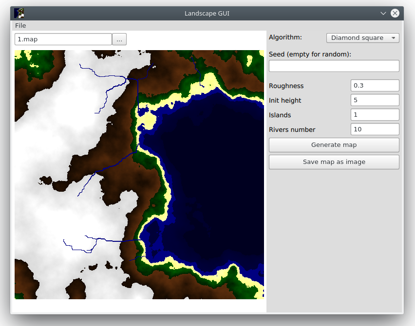

# Landscape generator

Tool for generating landscape written in C++ and Qt.

## Description

This tool uses 3 alogrithms of landscape generation:

- diamond-square;
- Perlin noise;
- hill algorithm.

Each algorithm has some params

## Dependencies

You need modern C++ compiler with C++11 support and Qt 5.9.0 or higher to build this project.

## Build

Open [QLandscape.pro](QLandscape/QLandscape.pro) with Qt Creator, set up environment and build the project. It will create 2 executables: gui and landscape.

## Usage

It is recommended to use GUI app with intuitive interface but you can also use console 'landscape' app. It has some flags which you can see in [source code](QLandscape/landscape/main.cpp).
<!-- TODO: add flags -->

## License

This program uses MIT license. For more information see the LICENSE file.
